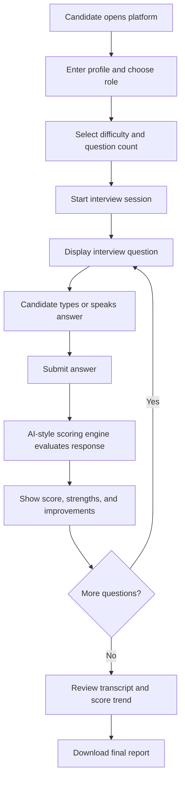

# AI Mock Interview Platform - Project Documentation

## 1. Project Overview

The AI Mock Interview Platform is a web-based interview preparation system. It helps candidates practice common technical, project-based, and HR interview questions. After every answer, the system gives an AI-style score and feedback using a defined rubric.

The project is designed as a complete demo application that can run directly in a browser without installation. A candidate can select a role, choose difficulty, answer questions, view feedback, track score progress, and download a final interview report.

## 2. Problem Statement

Many students and job seekers struggle to prepare for interviews because they do not receive immediate feedback. They may know the answer partially, but they may not know whether the answer is structured, relevant, clear, or supported with examples.

This platform solves that problem by creating a mock interview environment where users can practice repeatedly and receive instant improvement suggestions.

## 3. Objectives

- Provide a realistic mock interview flow.
- Support multiple interview roles and difficulty levels.
- Evaluate answers using a clear scoring rubric.
- Give strengths and improvement suggestions.
- Track score progress across the interview.
- Generate a downloadable final report.
- Keep the project simple to run and easy to demonstrate.

## 4. Main Modules

### Candidate Setup

The candidate enters their name, chooses an interview role, selects difficulty, chooses the number of questions, and enters a job focus area. The job focus helps the system prioritize questions that match the candidate's target role.

### Question Bank

The project includes question banks for:

- Frontend Developer
- Backend Developer
- Data Analyst
- HR / General Interview

Each role has beginner, intermediate, and advanced questions. Questions include hints, keywords, and sample answer points.

### Interview Session

The interview screen displays one question at a time. The user can type the answer or use browser-supported voice input. Navigation buttons allow the candidate to move between questions.

### AI-Style Scoring Engine

The scoring engine evaluates each answer using four categories:

- Relevance: Checks whether the answer includes important concepts related to the question.
- Structure: Checks whether the answer follows a clear flow, such as STAR or problem-solution-result.
- Evidence: Checks for examples, project details, metrics, tools, or concrete actions.
- Clarity: Checks answer length, sentence flow, and filler words.

The final score is calculated from the weighted combination of these categories.

### Feedback Report

After each answer, the platform shows:

- Overall score out of 100
- Rubric score breakdown
- Strengths
- Improvement suggestions
- Score trend chart
- Transcript history

The candidate can also download a final Markdown report.

## 5. Workflow



## 6. Tech Stack Explanation

### HTML5

HTML is used to create the structure of the application. The page contains sections for setup, interview questions, feedback, and transcript history.

### CSS3

CSS is used for the complete user interface design. The layout uses responsive grid styles so the project works on desktop and mobile screens.

### Vanilla JavaScript

JavaScript controls the main logic of the application. It handles question selection, answer saving, scoring, feedback generation, chart drawing, local storage, and report download.

### Web Speech API

The Web Speech API is used for optional voice input. If the browser supports it, the candidate can speak the answer and the platform converts it to text.

### Canvas API

The Canvas API is used to draw the score trend chart. This helps the user visually understand how scores change across questions.

### LocalStorage

LocalStorage saves the current interview session in the browser. If the page is refreshed, the session can be restored.

## 7. Scoring Logic

The scoring engine is implemented in `assets/js/app.js`.

It checks the answer using the following ideas:

- Keyword matching for relevance.
- STAR words and connectors for structure.
- Project/action words and numbers for evidence.
- Word count and filler-word checks for clarity.

Final score formula:

```text
Overall Score =
  Relevance * 0.35 +
  Structure * 0.22 +
  Evidence * 0.23 +
  Clarity * 0.20
```

This makes relevance the most important factor, while still rewarding structured and confident answers.

## 8. Why This Project Creates a Good Impression

- It is interactive and easy to demo.
- It connects directly to placement and interview preparation.
- It includes real user workflow, not just static pages.
- It demonstrates frontend development, JavaScript logic, browser APIs, scoring algorithms, data handling, and report generation.
- It is privacy-friendly because answers are processed locally.
- It is expandable into a larger product with authentication, database storage, and real AI API integration.

## 9. Limitations

- The current scoring engine is local and rule-based, not a large language model.
- Voice input depends on browser support.
- Data is stored only in the user's browser.
- There is no login system or backend database in this version.

## 10. Future Enhancements

- Add real AI model integration for deeper semantic evaluation.
- Add user login and cloud interview history.
- Store reports in a backend database.
- Add video recording and facial confidence analysis.
- Add mentor dashboard for reviewing multiple candidates.
- Add company-specific interview question sets.
- Add PDF export for final reports.

## 11. Conclusion

The AI Mock Interview Platform is a complete, practical, and demo-friendly project. It helps candidates practice interviews and receive instant feedback. The project shows strong understanding of user experience, JavaScript logic, scoring systems, browser APIs, and project documentation.
